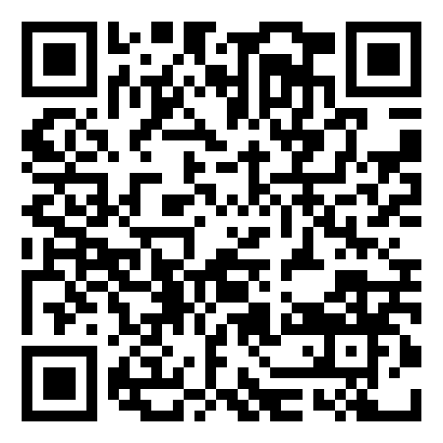

# Command Line QR Code Generator
_Developed by Luca Colaci (3176608)_

<p align="center" width="100%">
     
</p>

## Introduction

This aims at being a fast, reliable QR code generator from the command line.

## Core features

- Outputs the image to a specified directory. File extension can be explicited in the output path (support for .png, .jpg, .jpeg and other commonly used formats, a full list can be found on [PIL's official list of supported formats](https://pillow.readthedocs.io/en/stable/handbook/image-file-formats.html "PIL's official list of supported formats"))
- Independently set the minimum version, maximum version and error correction level;
- Accepts any payload encodable in Unicode format, and returns it a single byte-mode encoded data segment;
- Manually set the output dimension of the QR code. This might be overwritten with a minimum resolution for readability purposes, expecially for high-version QRs;
- Debug any issue by setting a verbosity level.

## Usage

Start by cloning the repo:
```console
git clone https://github.com/thecola13/QR-gen-python
cd QR-gen-python
```

Then, create a virtual environment and install the required dependencies:
```console
python -m pip install --upgrade pip
pip install -r requirements.txt
```

Then, run the script as follows:
```console
python qrgen.py --data https://github.com/thecola13/QR-gen-python --minversion 2 --maxversion 25 --ecl L --verbosity 2 --output github_repo_qr.jpg
```

List of available parameters and flags:
- `--data`, `--d`: link or data to be encoded in QR Code (characters not in UTF-8 might cause failures);
- (_Optional_) `--output`, `-o`: output file path (default: ./qrcode.png);
- (_Optional_) `--resolution`, `-r`: resolution of the QR Code in pixels (default: 300 x 300);
- (_Optional_) `--minversion`, `-mv`: force the minimum version of the QR Code (default: 1);
- (_Optional_) `--maxversion`, `-Mv`: force the maximum version of the QR Code (default: 40);
- (_Optional_) `--ecl`, `-e`: minimum error correction level: L (7%), M (15%), Q (25%), H (30%) (default: M);
- (_Optional_) `--verbosity`, `-v`: sets the verbosity level of the script (default: 0);
- `--help`, `-h`: Outputs the help menu in the command line.

## File content
- `qrgen.py`: contains the main script and command line argument parser;
- `qrcode.py`: contains the main functions and classes responsible for QR code generation;
- `utils.py`: contains utility functions and classes for console logging and error handling;
- `visualization.py`: contains the main QR code renderer and two debug renderes.

```text
QR-gen-python/
├─ README.md
├─ .gitignore
├─ requirements.txt
├─ qrgen.py
├─ qrcode.py
├─ utils.py
└─ visualization.py
```

## Future expansions
- [ ] Add support for image transparency
- [ ] Avoid QR code capacity limitation in edge cases with URL shortners
- [ ] Allow the user to embed a logo in the QR code
- [ ] Compile the code to allow for users to add it to personal CL commands
- [ ] Allow for bulk QR generation
